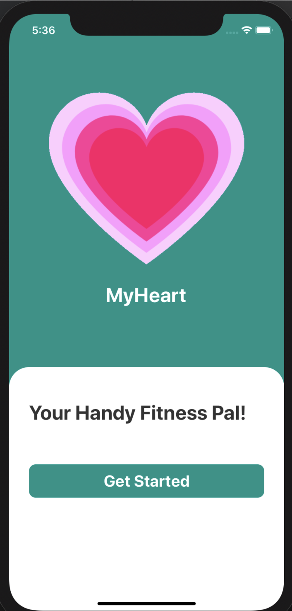
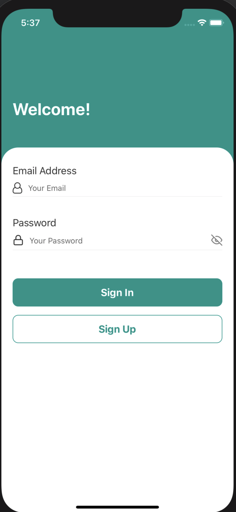
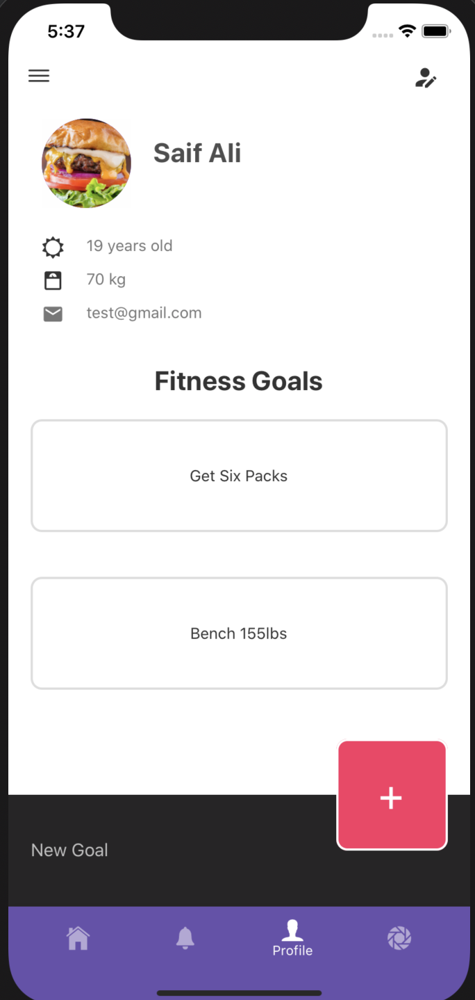
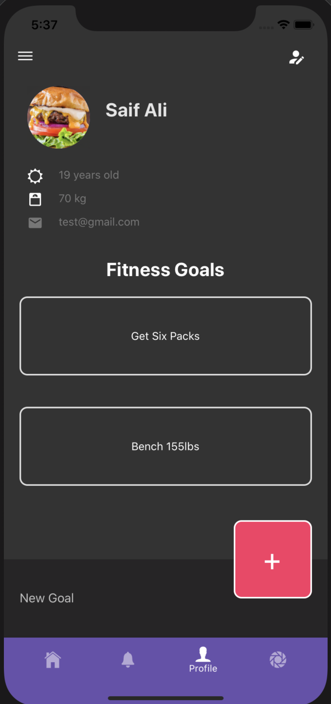

# FitMate
React Native Fitness App to track run, workout and calorie data\
Note: originally called MyHeart but repo project is still called MyHeart

    
    

    
    

    
    

    
    

    
    

    
    

    
    

    
    

    
    

    
    

    
    

